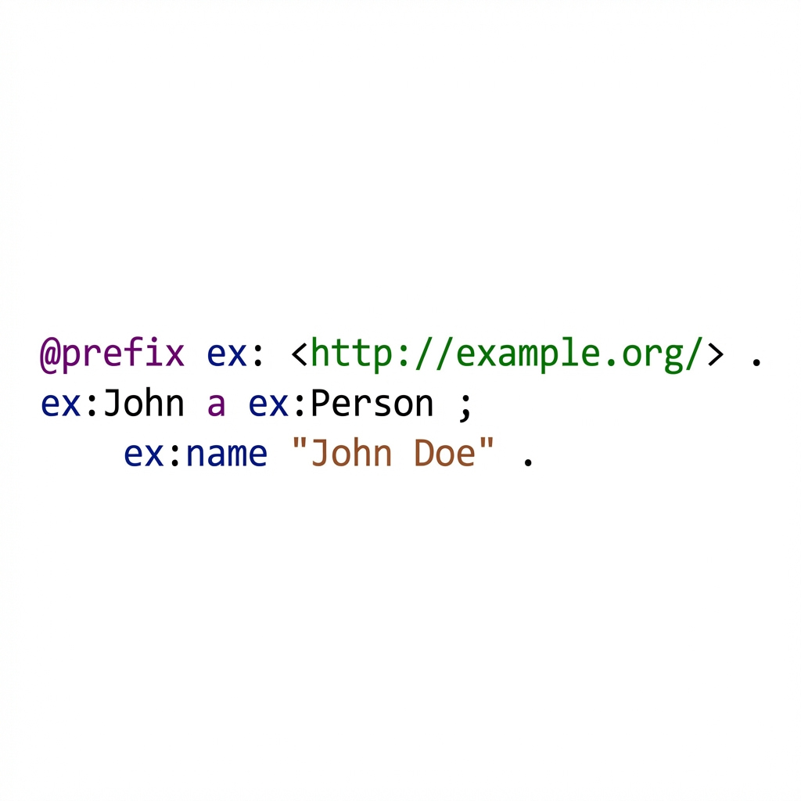
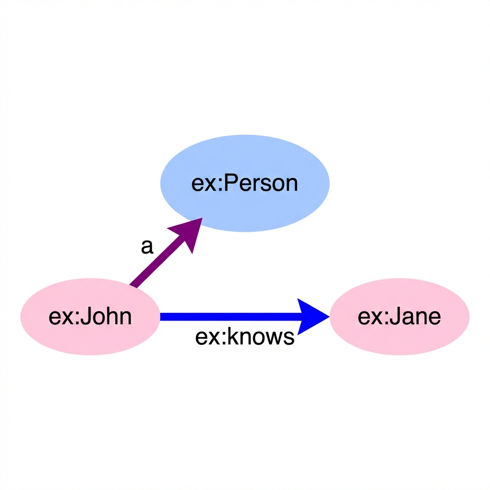

# Semantic Markdown Preview

A Visual Studio Code extension that brings your RDF, Turtle, and N3 files to life. **Semantic Markdown Preview** adds syntax highlighting and interactive graph visualizations directly within your Markdown preview.

## Features

### 1. Enhanced Syntax Highlighting
Get rich, semantic syntax highlighting for `turtle` and `n3` code blocks. Distinct colors for users, prefixes, IRIs, literals, and keywords make your data easier to read.

````markdown
```turtle
@prefix ex: <http://example.org/> .
ex:John a ex:Person ;
    ex:name "John Doe" .
```
````


### 2. Interactive Graph Visualization
Visualize your RDF data as a force-directed graph. You have two options:

*   **`preview`**: Renders the code block **AND** the graph visualization.
*   **`graph`**: Renders **ONLY** the graph visualization (hides the code).

````markdown
```turtle graph
@prefix ex: <http://example.org/> .
ex:John a ex:Person ;
    ex:knows ex:Jane .
```
````


The extension automatically:
*   **Classifies Nodes**: 
    *   **Classes** (Internal): Light Blue Ellipses.
    *   **External Classes**: Dark Blue Ellipses.
    *   **Instances**: Pink Ellipses.
    *   **Literals**: Yellow Rectangles.
    *   **Datatypes**: Grey Rectangles.
*   **Styles Edges**:
    *   **Hierarchy** (`subClassOf`): Thick Grey lines with hollow arrows.
    *   **Membership** (`a`/`rdf:type`): Purple lines.
    *   **Semantic**: Bright Blue lines.
    *   **Data**: Orange lines.
*   **Optimizes Layout**: Uses physics simulation to cluster related instances and separate hierarchies.

### 3. Customizable Filtering
Control what appears in your graph using simple flags in the code block header.

**Available Options:**
*   `no-literals`: Hide literal values (strings, numbers).
*   `no-external`: Hide classes from external namespaces (like `foaf`, `schema`).
*   `no-classes`: Hide all Class nodes.
*   `no-instances`: Hide all Instance nodes.

**Examples:**

*Hide literals to focus on relationships:*
````markdown
```turtle preview no-literals
@prefix ex: <http://example.org/> .
ex:John a ex:Person ;
    ex:knows ex:Jane ;
    ex:age 30 ;          # Hidden
    ex:name "John" .     # Hidden
```
````

*Show only the ontology structure (no instances or literals):*
````markdown
```turtle preview no-instances no-literals
@prefix ex: <http://example.org/> .
@prefix rdfs: <http://www.w3.org/2000/01/rdf-schema#> .

ex:Person a rdfs:Class .
ex:Employee rdfs:subClassOf ex:Person .
# Instances like ex:John a ex:Employee will be hidden
```
````

### 4. Theme Support
Fully compatible with both Dark and Light themes. The visualization colors adapt to ensure readability in any environment.

## Usage

1.  Open a Markdown file.
2.  Create a code block with `turtle`, `n3`, or `rdf`.
3.  Add `preview` to the header to enable visualization.
4.  (Optional) Add filters like `no-literals` to customize the view.
5.  Open the **Markdown: Open Preview** command.

## Requirements

*   Visual Studio Code 1.96.0 or higher.
*   No external dependencies required (extension bundles everything).

## Extension Settings

Currently, this extension uses inline configuration via Markdown code block attributes. Global settings may be added in future versions.

## Known Issues

*   Complex `owl:unionOf` constructs are currently visualized as raw lists.
*   Graph layout may shift slightly on re-render due to the physics engine.

## Release Notes

### 0.0.1
*   Initial release.
*   Support for Turtle/N3 syntax highlighting.
*   Interactive Graph Visualization with Cytoscape.js.
*   Filtering options (`no-literals`, `no-external`, etc.).
